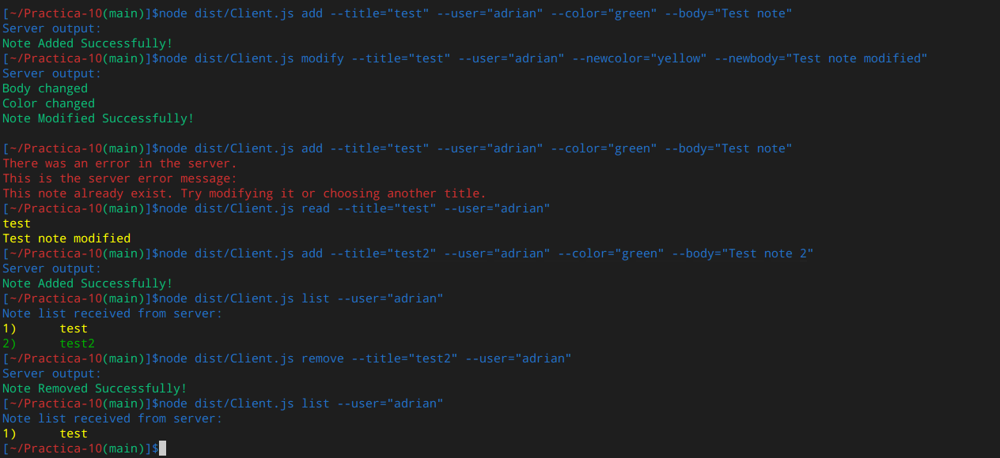

# Desarrollo de Sistemas Informáticos 
## Práctica 10: Implementación de un cliente y un servidor de la aplicación de procesamiento de notas mediante Sockets en Node.js
### Autor: Adrián González Hernández
### Email: alu0101216775@ull.edu.es
### Fecha de entrega: 09/05/2021

* * *

## Estado de pruebas y cubrimiento

<p align="center">
    <a href='https://github.com/ULL-ESIT-INF-DSI-2021/ull-esit-inf-dsi-20-21-prct10-async-sockets-alu0101216775/actions/workflows/nodejs-ci.yml'></a> 
    <a href='https://coveralls.io/github/ULL-ESIT-INF-DSI-2021/ull-esit-inf-dsi-20-21-prct10-async-sockets-alu0101216775?branch=main'></a>
    <a href='https://sonarcloud.io/dashboard?id=ULL-ESIT-INF-DSI-2021_ull-esit-inf-dsi-20-21-prct10-async-sockets-alu0101216775'></a>
    <a href='https://sonarcloud.io/dashboard?id=ULL-ESIT-INF-DSI-2021_ull-esit-inf-dsi-20-21-prct10-async-sockets-alu0101216775'></a>
    <a href='https://sonarcloud.io/dashboard?id=ULL-ESIT-INF-DSI-2021_ull-esit-inf-dsi-20-21-prct10-async-sockets-alu0101216775'></a>
</p>

## Introducción
Esta práctica tiene la finalidad de familiarizarse con el entorno de desarrollo de Node, especialmente con el uso de Sockets. Se busca hacer uso del sistema de gestión de notas realizado en la Práctica 8, añadiéndole un sistema cliete-servidor. Se seguirá una metodología TDD, se usarán github actions y se documentará el código con typedoc.

## Objetivos
* Familiarizarse con el entorno de desarrollo Node
* Comprender el uso de los Sockets y el sistema de archivos
* Mejorar el desarrollo con Typescript
* Realizar pruebas con TDD y medir el cubrimiento con Coveralls
* Usar los paquetes yargs y chalk
* Generar documentación con typedoc
* Lanzar github actions
* Generar informe en Github Pages

* * *

## Los tipos ResponseType y RequestType

Para impementar esta práctica basada en Sockets, y por lo tanto en peticiones cliente-servidor, se han creado tipos para representar tanto las peticiones del cliente como las respuestas del servidor. Para evitar generar un tipo para cada comando a ejecutar, estos tipos contarán con varios parámetros opcionales que se enviarán o no según el tipo de comando a realizar y los parámetros recibidos por la línea de comandos de yargs. Estos son los tipos:

```TypeScript
export type RequestType = {
    type: 'add' | 'modify' | 'remove' | 'read' | 'list' | 'null';
    title?: string;
    body?: string;
    color?: string;
    user?: string;
    route?: string;
    newtitle?: string;
    newbody?: string;
    newcolor?: string;
}

export type ResponseType = {
    type: 'add' | 'modify' | 'remove' | 'read' | 'list' | 'errcode';
    success: boolean;
    message: string;
    notes?: Note[];
}
```

Ambos tipos están preparados para una gestión eficiente de los errores y el procesamiento según el tipo de comando. 
* RequestType cuenta con un tipo "null", haciendo que no se lance la petición al servidor al final. Este tipo se asigna cuando se detecta un error a la hora de construirla en el procesamiento de parámetros, y evita que se continue el flujo del programa.
* ResponseType tiene el tipo "errcode". Este tipo se asigna siempre que el servidor detecte cualquier error a la hora de ejecutar las peticiones. Indica al cliente que la información recibida se corresponde únicamente a los mensajes de error correspondientes.

* * *

## Creación de peticiones

Las peticiones que realizará el cliente son del tipo RequestType. Todas ellas se generan en función de los parámetros recibidos por yargs.
Para ello, la función InitializeYargsCommands() se encarga de leer los parámetros que escriba el usuario, y almacenarlos en una petición que recibe el cliente. Si la petición se ha generado correctamente, su tipo será diferente de null. En ese caso, el cliente comenzará a ejecutarse y mandar la petición al servidor.

Este es un ejemplo, generando la petición para el comando add. Está en el handler del comando correspondiente:

```TypeScript
handler(argv) {
    //Comprueba que los argumentos requeridos sean del tipo correcto
    if (typeof argv.title === 'string' && typeof argv.body === 'string' && typeof argv.user === 'string') {
    let noteToAdd: Note;
    //Retira caracteres especiales del titulo para evitar problemas con el sistema de ficheros, y genera el nombre del fichero en formato json
    let filename: string = argv.title.replace(/[&\/\\#,+()$~%.'":*?<>{}!¡¿]/g, '') + '.json';
    //Genera la ruta de la nota, usando su usuario y su nombre de fichero
    let notePath: string = `notes/${argv.user}/${filename}`;
    //Comprueba si se ha pasado el parámetro no requerido "color". Si no es así, se asigna blue por defecto en la petición.
    if (typeof argv.color === 'string') req = { type: 'add', title: argv.title, body: argv.body, user: argv.user, route: notePath, color: argv.color };
    else req = { type: 'add', title: argv.title, body: argv.body, user: argv.user, route: notePath, color: "blue" };
    return req;
}
```

* * *

## El cliente

EL fichero Client.ts corresponde al cliente. Este programa únicamente se encarga de llamar a InitializeYargsCommands(), almacenando la petición en una variable. Si la petición no tiene ningún error, establece una conexión con el puerto 60300 del servidor, y manda la petición una vez aplicado el método JSON.stringify().

El cliente queda a la espera de la respuesta del servidor. Cuando la haya recibido, procede a almacenarla en una string hasta recibir el end. Convierte la cadena a un objeto JSON, comienza a procesarla. Si el elemento type de la respuesta es errcode, muestra los errores correspondientes por consola. Si es de los tipos add, remove o modify, mostrará por consola la salida que haya tenido el servidor. Por último, si es del tipo read o list, mostrará por consola la nota o lista de notas recibida respectivamente.

* * *

## El servidor

El comportamiento del servidor es bastante sencillo. Cuando se ejecuta, entra en modo de escucha en el puerto 60300. Al recibir una petición por parte de un cliente, comienza a almacenarla en una variable hasta recibir el caracter '\n'. Cuando lo haya recibido, emite un evento 'request' junto con la cadena de la petición.

El manejador del evento request recibe ese evento, y comienza a ejecutarse. Primero, convierte el string de la petición en un objeto con JSON.parse(), y comienza a preparar la respuesta del servidor. En función del tipo de petición recibida, el servidor llama a la función correspondiente del gestor de la aplicación de notas diseñado en la práctica 8. Dicha función se encarga de añadir, modificar o eliminar las notas indicadas en la petición, además de almacenar los mensajes de confirmación o error para retornarlos en la que será la respuesta del servidor. En el caso de lectura o lista, almacenará también el o los objetos Note leidos en la respuesta del servidor.

Esta es una de las funciones, correspondiente al comando modify:

```TypeScript
modifyNote(note: string, ntitle: string, nbody: string, ncolor: string): ResponseType {
    let res: ResponseType = { type: 'errcode', success: false, message: "Unknown error" };
    if (this.checkIfFileExist(note)) {
        try {
            let msg = "";
            let noteToModify: Note;
            let readNote: string = fs.readFileSync(note).toString();
            noteToModify = this.JSONtoNote(readNote);
            if (ntitle !== "") {
                msg += "You have changed the title, so the note will be removed and created with the new title.\n";
                this.deleteNote(note);
                noteToModify.setTitle(ntitle);
                let filename: string = ntitle.replace(/[&\/\\#,+()$~%.'":*?<>{}!¡¿]/g, '') + '.json';
                noteToModify.setRoute(`notes/${noteToModify.user}/${filename}`);
                msg += "Title changed\n";
            }
            if (nbody !== "") {
                noteToModify.setBody(nbody);
                msg += "Body changed\n";
            }
            if (ncolor !== "") {
                noteToModify.setColor(ncolor);
                msg += "Color changed\n";
            }
            fs.writeFile(noteToModify.getRoute(), this.noteToJSON(noteToModify), () => { });
            msg += "Note Modified Successfully!\n";
            res = { type: 'modify', success: true, message: msg };
        } catch {
            res = { type: 'errcode', success: false, message: "Something went wrong. It was not possible to modify the note." };
        }
    } else {
        res = { type: 'errcode', success: false, message: "This note does not exist. Try another title or create that note." };
    }
    return res;
}
```

Como se puede observar, su comportamiento es prácticamente el mismo que en la práctica 8. La única diferencia está en que los logs o errores ahora se van almacenando en la respuesta del servidor, que ahora la función retornará para que el servidor la pueda enviar.

Una vez se ha generado esta respuesta, se envía de nuevo al cliente mediante el Socket, y se cierra la conexión para que así el cliente pueda procesarla.

* * *

## Prueba de funcionamiento

A continuación se muestra una prueba de la ejecución del programa desde el cliente, una vez que el servidor se ha puesto en modo de escucha. En ella se muestran todos los comandos, así como uno de los errores que se pueden detectar con el tipo "errcode":




* * *

## Integración continua con Github Actions

Para esta práctica se ha configurado una GitHub Action encargada de llevar a cabo la integración continua del código. Para ello, se ha creado la acción de CI en NodeJS en el repositorio de GitHub. Se ha añadido, además, un fichero llamado **nodejs-ci.yml** en el directorio **.github/workflows**, encargado de gestionar la acción.

Se ha añadido la insignia correspondiente al README del repositorio y a este informe.

* * *

## Cubrimiento del código con coveralls

El código tiene pruebas mediante TDD realizadas con mocha, chai y sinon, y cubrimiento con Istanbul (nyc). Haciendo uso de una Github Action y de la web coveralls, se recopila la información de cubrimiento en formato lcov y se envía a coveralls, pudiendo acceder a información al respecto.

El porcentaje de cubrimiento total no alcanza el 100% ya que las líneas de control de errores de los bloques catch no son comprobadas para evitar hacer fallar otros test. Sin embargo, el cubrimiento de las funciones es del 100%.

Además, se añade una insignia a la documentación, indicando el porcentaje de código cubierto.

* * *

## Controles de calidad con Sonar Cloud

La web Sonar Cloud permite hacer un seguimiento a la calidad del código, teniendo en cuenta diversos factores. Para esta práctica, se ha hecho especial hincapié a la calidad, la mantenibilidad y la seguridad, aunque SonarCloud incluye muchos más parámetros.

Se han añadido esas insignias a la documentación del código.

* * *

## Configuración de Github Pages

El último paso consiste en implementar GitHub Pages desde el repositorio. Para hacerlo, se debe acceder a la sección “settings” en el repositorio en GitHub. Una vez allí, en la zona “GitHub Pages” se debe hacer lo siguiente:

1. Habilitar GitHub pages en el repositorio
2. Seleccionar la rama de trabajo (en este caso, master) y la carpeta raíz (en este caso, /docs, ya que allí se encuentra el archivo index.md) y marcar save
3. Elegir un tema para la página. Una vez hecho, solo queda esperar unos segundos y acceder a la página que aparece para ver la web.

* * *

## Conclusiones

El uso de estas herramientas como Sonarcloud y coveralls ayuda bastante a controlar si el código está realmente listo para producción o no. Además, la infraestructura de desarrollo de Node está preparada para facilitar en gran medida el uso de toda clase de herramientas externas que ayudan mucho en estos aspectos.

El uso de sockets en lenguajes como TypeScript facilita bastante el trabajo con ellos, evitando tener que controlar múltiples temas de memoria que consumen mucho tiempo en lenguajes como C.